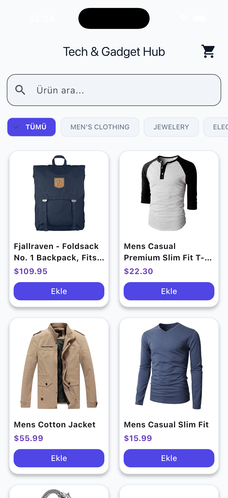
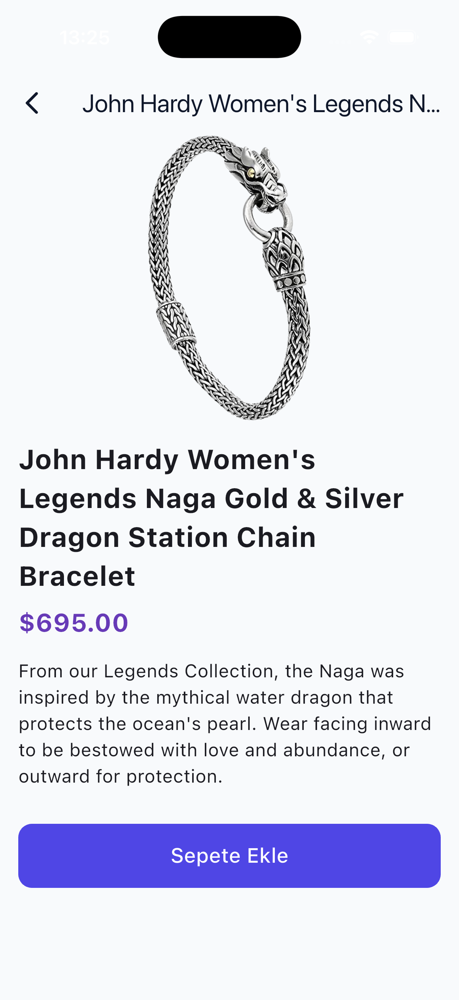
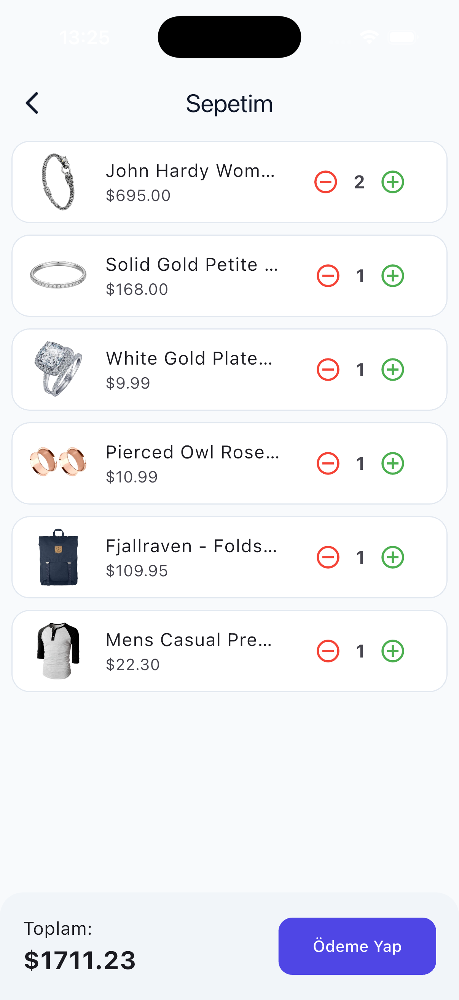
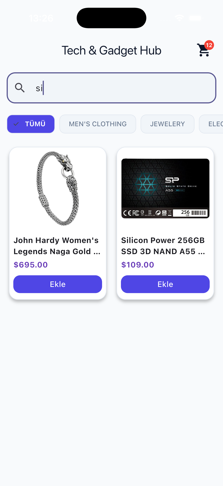
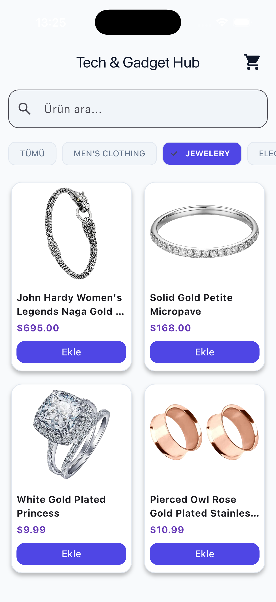

# Tech & Gadget Hub - Modern Katalog Uygulaması

## Proje Hakkında
Bu proje, Flutter eğitim kampı kapsamında geliştirilmiş, modern UI/UX tasarım standartlarına sahip bir mobil e-ticaret/katalog uygulamasıdır. Temel liste mantığının ötesine geçilerek gerçek bir API entegrasyonu ve dinamik sepet yönetimi ile zenginleştirilmiştir.

## Öne Çıkan Özellikler
- **Gerçek Zamanlı Veri (API):** Fake Store API kullanılarak ürünler internet üzerinden asenkron olarak çekilmektedir.
- **Akıllı Arama ve Filtreleme:** Kullanıcılar ürün isimlerine göre arama yapabilir ve API'den dinamik olarak çekilen kategorilere göre listeyi filtreleyebilir.
- **Gelişmiş Sepet Yönetimi:** Aynı ürünler sepette gruplanır, adet artırma/azaltma işlemleri yapılabilir ve anlık toplam tutar hesaplanır.
- **Modern Arayüz (UI):** Flat Design prensiplerine uygun, gölgesiz ve temiz bir tasarım dili kullanılmıştır. Sayfalar arası geçişler Navigator ile sağlanmıştır.

## Kullanılan Teknolojiler
- **SDK:** Flutter
- **Dil:** Dart
- **Paketler:** `http`
- **Mimari:** StatefulWidget tabanlı State Management

## Ekran Görüntüleri

| Ana Sayfa | Detay Sayfası | Sepet Sayfası | Arama | Kategoriler |
|:---:|:---:|:---:|:---:|:---:|
|  |  |  |  |  |

## Çalıştırma Adımları

Projeyi kendi ortamınızda çalıştırmak için aşağıdaki adımları izleyebilirsiniz:

1. Bu depoyu (repository) bilgisayarınıza klonlayın:
```bash
git clone https://github.com/aziz-mevlana/tech_katalog/
```

2. Terminal üzerinden proje klasörüne girin:
```bash
cd tech_katalog
```

3. Gerekli Flutter paketlerini indirin:
```bash
flutter pub get
```

4. Uygulamayı bağlı bir emülatörde veya fiziksel cihazda çalıştırın:
```bash
flutter run
```